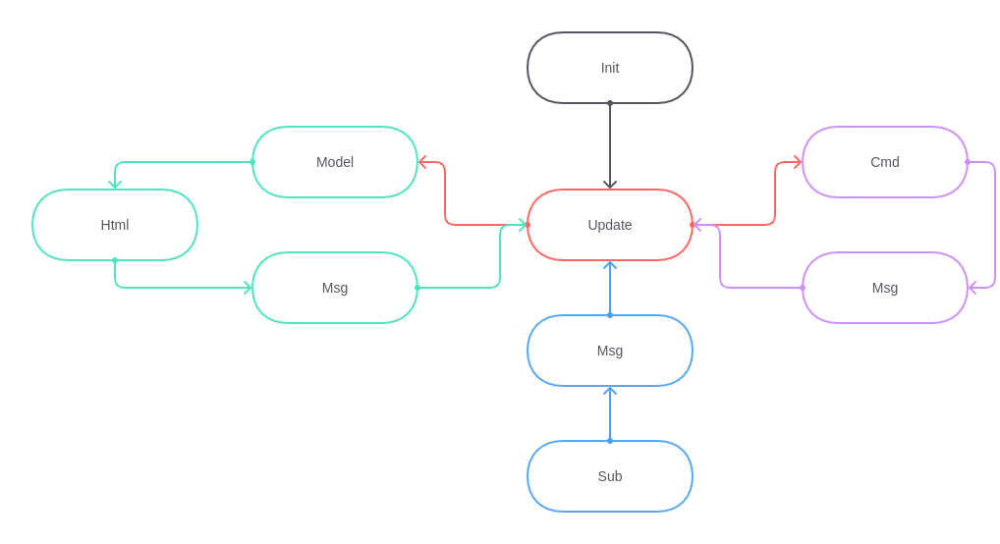

# The first steps

I will not describe what NodeJS does exactly, neither how the SCSS works. NodeJS builds the assets using [Parcel](https://parceljs.org/) and put them in `/public/static`. SCSS gives the style of your application. If you want to learn more, I let you Google it.


## Folder arborescence

Lets first introduce you the architecture I chose. 

- `/.github/workflows`: This folder is used to store the directives for Github Action. It will build the assets, build the extension file for Chromium and Firefox, and push the changes to Github Pages. This is only for automation, nothing to do there.

- `/assets/(elm|scss)`: This is where we put the Elm and SCSS files. All files are imported by the entrypoint `assets/app.js`. You will mainly edit the files from these 2 folders.

- `/extension`: This is where we put the `index.html`, the manifest for the extension, the images and where the built assets will be put.

- `/package.json`: A file to store everything about your NodeJS application. This will be not edited as everything you need is already available.

- `/elm.json`: The equivalent of `package.json` but for Elm. You can notice inside that there is the entry `source-directories` where you list all the paths where your Elm files are. I recommand you, except for the entry, to edit nothing by hand here.


You can edit `/extension/manifest.json` to set the name of the project and the author: you. These information will be available from your webbrowser when the extension is finally loaded in it.


## First build and view

Before getting to Elm, we need to know how to build the assets. First and foremost, you need to install the dependencies. Simply execute in a terminal `yarn install` and let the magic happen.

To build the assets for production, type in a terminal `yarn build`. But it is not very convenient to execute this command everytime you make a change. 

To watch the files, rebuild when something changed, and to refresh the webpage automatically, use the command `yarn watch`.

Now that the assets are watched, open the `/extension/index.html` file with your favorite browser. No need for a webserver, everything should work perfectly. You can now see the following page, congratulations!


## Elm

Lets take a look at Elm by opening `/assets/elm/Main.elm`. Now that you have some beautiful code on your screen, it is time for some theory. It is important, very important. Don't skip this part because you want to tweak. Elm is very atypical, and very restrictive too. You need to understand how it processes data and how it handles interruptions.


### A word about the language

You can notice that the code is formatted weirdly. This is Elm, get used to it because `elm-format` will force you to.

In Elm, everything is a function. A variable is not a variable, but a function that returns a value. This will be important, as Elm can do wonderful things with function composition.

Note that every functions has a signature `myFunction : a -> b -> c`. This is not mandatory, but consider that it is. The previous signature means that the function `myFunction` take 1 argument of type `a`, then 1 argument of type `b` and returns something of type `c`.

Small letters in a signature means that we are not restricting the type. But with an capital letter at the beginning like `Model`, it means we restrict the value to be of the type `Model`.

One last thing. You can notice something like `let ... in`. This is where you can create variables that can be used in the following block.


### Model

Elm stores **every** variables within its Model. You can create ephemeral variables, but then will never last more than 1 cycle. I'll explain what it means after. So the Model should be declared carefully. A mess in your Model is a mess for the whole page. But you will be careful, I am sure!

The first thing you will do when creating a new page is creating the Model type alias. A type alias is like an associative array in other languages. It mean in Elm that this type alias is a combination of multiple types.

In our skeleton, the model is declared like this:

```elm
type alias Model =
    { firstname : String
    }
```


### Update and Message

The only way to edit the model is from the `update` function. This is also the only way to excute a command. The update uses the `Msg` type, a type with fixed values that you declare. It works like an interruption. You click on something, it triggers a message called `MsgOnClickOnSomething` and start a cycle where it is handled in the `update`, edit the model, start commands if asked and update the view.

In the skeleton, the `Msg` type and the `update` function are declared like following:

```elm
type Msg
    = MsgNoOp


update : Msg -> Model -> (Model, Cmd Msg)
update msg model =
    case msg of
        MsgNoOp ->
            ( model, Cmd.none )
```

Here, the `case ... of ...` is a kind of `switch` in other languages but is much more powerful. You are forced to process **all** values of `msg`. Here, `Msg` can only be `MsgNoOp` but if you add a new value like following, the compiler will crash, asking you to handle all possibles values.

```elm
type Msg
    = MsgNoOp
    | MsgOnClickOnSomething
    | MsgOnChange String
```

Note that you can attach values to your message.

The `update` function returns a couple of `Model` and `Cmd Msg`. To edit the model, for instance the `firstname`, you can do it like following:

```elm
update : Msg -> Model -> (Model, Cmd Msg)
update msg model =
    case msg of
        MsgOnChange value ->
            ( { model | firstname = value }
            , Cmd.none
            )

        _ ->
            ( model, Cmd.none )
```

Here we extract the String value from the message and set the `firstname` entry of the model to this value. Note that the next case is `_`, which means whatever value. So it counts as `MsgNoOp` and `MsgOnClickOnSomething`, but not `MsgOnChange` because it is handled before.

But what about the `Cmd Msg`.


### Commands

The commands are asynchronous tasks like AJAX calls. It is a background process that will trigger an update with the given message when finished.

The following example uses the [Http library](https://package.elm-lang.org/packages/elm/http/latest/Http) to make a `GET` call.


```elm
type Msg
    = MsgOnClick
    | MsgGotText (Result Http.Error String)


update : Msg -> Model -> (Model, Cmd Msg)
update msg model =
    case msg of
        MsgGotText result ->
            case result of
                Ok value ->
                    -- The variable value is the stringify website
                    -- But we do nothing with it
                    ( model, Cmd.none )

                Err _ ->
                    -- Something happened, and the request failed
                    (model, Cmd.none )
        
        MsgOnClick ->
            ( model
            , Http.get
                { url = "https://elm-lang.org/assets/public-opinion.txt"
                , expect = Http.expectString MsgGotText
                }
            )

```


### Initialization

The last thing is initilization. This is done thanks to the `Flags` and the `init` function which will create the first `Model`, and start the first `Cmd Msg`. The `Flags` are given at the initialization from the Javascript. This is handy to pass variables mandatory for the initialization of Elm.

Here, our initialization is like following:

```elm
type alias Flags =
    { firstname : String
    }


init : Flags -> (Model, Cmd Msg)
init flags =
    ( { firstname = flags.firstname
      }
    , Cmd.none
    )
```


### Subscriptions

You can notice that there is something called subscriptions. This is useful to get data from the outside world and trigger an update cycle.

When creating a subscription, Elm expsoes functions called ports that is accessible from the outside world (the Javascript). When called, it triggers an update cycle with the message attach to this port.

We will not use any subscription in this Dashboard. That is why in the `main` function, you can find that we do nothing: `subscriptions = \_ -> Sub.none`.


### Summary

To finish this part, a handy schema to have under the hand is this one. Everything starts with `init`, which builds the `Model` and can create a `Cmd Msg`.



The `Model` edited updates the view (`Html`), which can trigger a new update cycle using a message. A command (`Cmd`) or a subscription (`Sub`) can also trigger a new update cycle.

Note the `Html`, the `Cmd` and the `Sub` are the only elements that can trigger an update cycle using a `Msg`. This is why they are written `Html Msg`, `Cmd Msg` and `Sub Msg`, because they are always associated with a message.


### Bonus: Composition

I told you about composition. Lets scratch the surface with an example. We want to use `myFunction` but we would like to give the `b` value first. This case is nothing special, it happens quite regulary. 

The first thing to do it to check the signature. So we have `myFunction : a -> b -> c`. And we want now to have `myFlippedFunction : b -> a -> c` and we need a function to transform it. We will call it `flip` and `flip myFunction` should have the target signature. So in theory: `flip (a -> b -> c) -> b -> a -> c`. This function does not restricts the input types so it can be used on any function to "flip" the arguments.

```elm
flip : (a -> b -> c) -> b -> a -> c
flip inputFunction secondArgument firstArgument =
    inputFunction firstArgument secondArgument


something : Model -> Html Msg
something model =
    let
        myFlippedFunction = (flip myFunction)
    in
    ...
```


<hr />

#### [Back: Installation](Installation.md) <span style="float: right">[Next: The Clock wiget](Clock.md)</span>